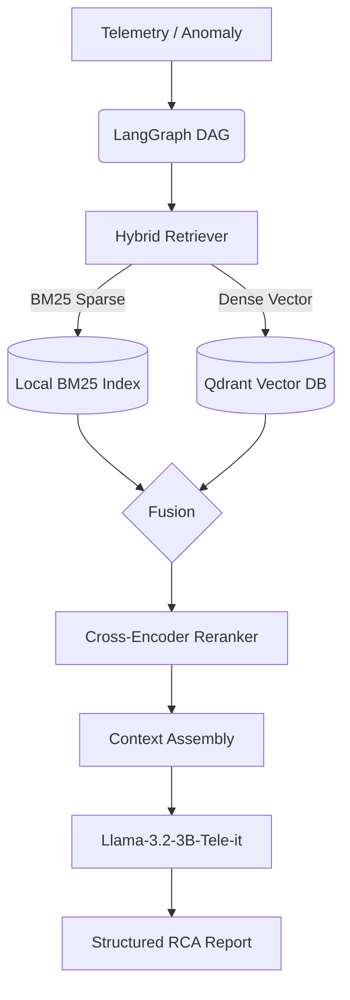
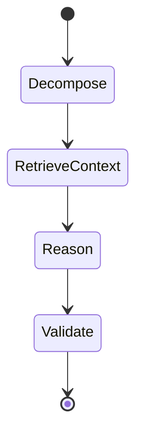
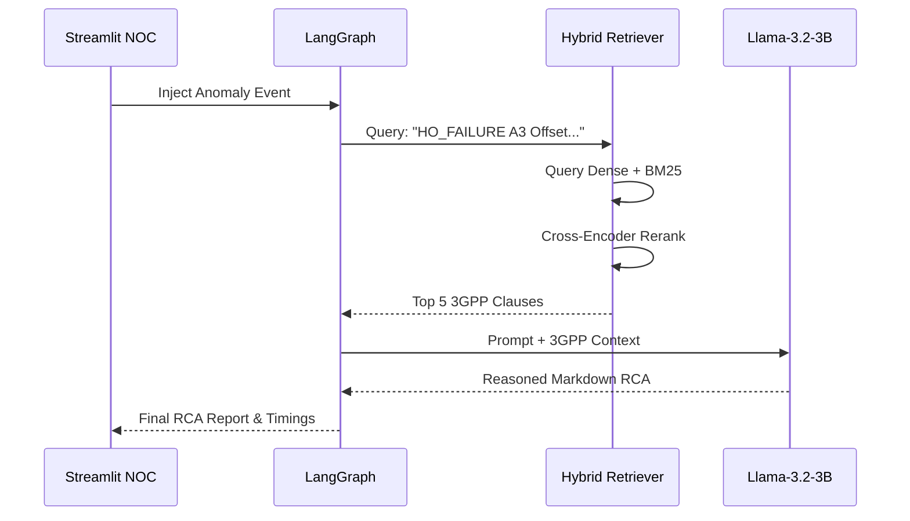

# FCRAG 2.0 System Architecture

FCRAG 2.0 uses an advanced Agentic Retrieval-Augmented Generation (RAG) architecture tailored for 3GPP telecommunication environments. The system relies entirely on a locally-executable, open-weight stack.

## System Overview

At the highest level, the FCRAG system follows a pipeline structure where anomalous telemetry feeds into an intelligent execution graph, extracts context from technical specifications, and synthesizes a Root Cause Analysis (RCA).

## The LangGraph Execution Graph

The core orchestration happens within `src/fcrag/reason/graph.py`, leveraging a Directed Acyclic Graph (DAG) state machine:

### 1. Decompose Node (`src/fcrag/reason/agents/decomposer.py`)
- **Input:** Raw `anomaly_event` dict (e.g., cell_id, severity, kpi_deltas).
- **Function:** Normalizes the KPI deviations and formats a clear natural-language query out of raw numeric alarms.

### 2. RetrieveContext Node (`src/fcrag/reason/agents/retriever_agent.py`)
- **Function:** Calls the `HybridRetriever`.
- **Hybrid Search Pipeline:**
  - **Sparse (BM25):** Executes lexical search via `rank_bm25` against `.pkl` indexes (`data/processed/indexes/`).
  - **Dense (Qdrant):** Executes semantic search using `sentence-transformers/all-MiniLM-L6-v2` against a local Qdrant disk instance (`data/qdrant_db/`).
- **Fusion:** Results from both sparse and dense retrievals are merged.
- **Reranking:** A `cross-encoder/ms-marco-MiniLM-L-6-v2` evaluates the precise relevance between the query and the retrieved documents, significantly improving context quality and preventing hallucinations.
- **Context Assembly:** The top 5 reranked clauses are formatted with source attribution tags.

### 3. Reason Node (`src/fcrag/reason/agents/reasoning_agent.py`)
- **Function:** Injects the formatted 3GPP context and the original query into the prompt schema.
- **LLM Reasoning:** Interacts with `AliMaatouk/Llama-3.2-3B-Tele-it` (via `src/fcrag/reason/llm_client.py`). The model strictly derives the Root Cause Analysis from the context window, avoiding out-of-domain guessing.

### 4. Validate Node (`src/fcrag/reason/agents/validator.py`)
- **Function:** A final safety checkpoint that parses the generated markdown string into a structured layout (Problem, Root Cause, Recommendations) and checks for formatting anomalies.

## Data Flow Diagram

